# agent-build

<p align="center"><strong>A Claude Code plugin that takes one unit of work from a request to a merged pull request.</strong></p>

<p align="center">
  <a href="LICENSE"></a>
  <a href=".github/workflows/ci.yml"></a>
</p>

`/build` is a [Claude Code](https://code.claude.com) skill that takes one unit of work from a request to a merged pull request:
it writes a brief, builds it with one agent per part, reviews the diff with a wave of reader agents
and up to four fix rounds, hand-tests it, and ships it. It runs in your repo through your own `git`,
`gh`, and test commands, which each repo maps once in a small steps file. This repo is the whole
system as a Claude Code plugin: the skill, its twelve agents, the runtime scripts its steps run, and
a guard that keeps a subagent from pushing. It is for anyone who works in a repo with Claude Code and
wants a whole unit of work carried through by one command, under their own branch and merge rules.

## Install

What a run needs on PATH:

- [Claude Code](https://code.claude.com).
- `git`.
- `node` 22.18 or newer: the runtime is TypeScript that `node` runs directly.
- [`gh`](https://cli.github.com), logged in (`gh auth login`): the built-in push, PR and merge steps use it.
- `jq`: the no-push guard reads its hook input with it, and refuses a subagent's command while it is missing.

One paste, with those installed:

```
git clone https://github.com/federbenjamin/agent-build ~/agent-build && ~/agent-build/install.sh
```

`install.sh` makes three links and then registers the clone as a plugin marketplace and enables the
plugin from it. The plugin loads from the clone in place: after a `git pull`, run `/reload-plugins`
in a session. The `owner/repo` marketplace form (`claude plugin marketplace add <owner>/<repo>`) is
not offered: Claude Code would clone a second copy into its plugin cache while `~/.agent-build`
links the first, and the skill text and the runtime would drift apart.

The links, because the skill, its agents, and the runtime name the build system by one path:

```
~/.agent-build/runtime -> <this repo>/runtime
~/.agent-build/skills  -> <this repo>/skills
~/.agent-build/agents  -> <this repo>/agents
```

It refuses a path that exists and is not a symlink, leaves a correct link `unchanged`, and repoints
one that aims elsewhere. It reads and changes only the user-scope plugin install, so a project or
local install of the plugin is left as it is. A re-run finishes an install that stopped partway.
`./install.sh --check` changes nothing: it prints each link's state (`ok`, `missing`,
`points at <x>`, `not a symlink`) and exits non-zero unless all three are `ok`. Running builds
execute the files these links reach, so repointing them moves every running build.

## Features

- **One command from a request to a merged PR.** `/build <request>` writes the brief, builds each part with its own agent, reviews the diff with a wave of readers and up to four fix rounds, hand-tests the result, and ships it through your repo's own push, PR and merge commands.
- **Your commands, mapped once.** Each repo names its install, checks, tests, push, PR and merge commands in `.claude/build-steps.toml`; a repo without one runs on the built-in defaults (`npm test`, `git push`, `gh pr create`, `gh pr merge`) and the run's record says so.
- **Twelve agents with one job each.** Brief writer, builders, reviewers, fixers, test author, hand tester and more, spawned as `agent-build:<name>`, each with its own model and context.
- **No agent grades its own work.** The brief is committed before the code, tests come from writers who did not write the code, and every fix is made by a fresh agent and re-read by a fresh reader.
- **A subagent never pushes.** A hook refuses a push or a PR open, ready, edit or merge from any subagent, in the built-in `git`/`gh` forms and in your repo's own steps, and logs each refusal.
- **Codex is optional.** With the `codex` CLI on PATH, Codex writes plain test slices and pairs a second review with Claude's; without it, every job runs on Claude.
- **A launcher can follow the run.** Each milestone goes out as one JSON line through `BUILD_EVENT_CMD`, so a desk or dashboard can watch a build without the build knowing it.

## Usage

In a Claude Code session inside the repo the work belongs to:

```
/build <what to build, or a path to a request file>
```

Saying "build X" runs it too. `/build` enters its own worktree under `.claude/worktrees/`, then
brief-writes, builds, reviews, hand-tests and ships from that one session, and stops only for what
the request and the repo's rules do not settle. Keep a request file (a plan, a brief, or a ticket)
outside the repo, so it never rides into the branch. To run without a terminal session, pass the
same line as the prompt of a headless run from the repo; Claude Code expands a `/skill` at the start
of a `-p` prompt:

```
claude -p --permission-mode auto "/build <path to the request file>"
```

`/build --from-branch <name>` runs the review and ship stops over a branch nobody briefed.

### Permission mode

/build runs `git`, `gh`, `node`, and the commands your build steps name at every step, and its
agents inherit the session's permission mode (a plugin agent's own `permissionMode` is ignored). Run it in `auto` mode, or in `acceptEdits`
with Bash allowed. In `default` mode every command prompts.

## Configuration

The build steps file, where a run keeps its files, and how Codex roles resolve are in
[docs/configuration.md](docs/configuration.md).

### Build events

A launcher that wants to follow a build learns of its milestones through `BUILD_EVENT_CMD`; the variable, the event schema and the consumer rules are in [docs/build-events.md](docs/build-events.md).

## How it works

### The run

A run has four stops, in one session: **BRIEF**, **BUILD**, **CLOSE** and **SHIP**. The session
that ran `/build` owns everything around the agents (the class, the worktrees, the spawns, the
merges, the run's ledger) and reads each agent's one-line report and each script's output, never a
reader's findings or the builder's whole diff. It merges the parts and the tests once every builder
and writer is done and the exit checks pass.

<p align="center"></p>

The run's four stages, left to right, with CLOSE's fix loop and the one exit that stops for you.
Blue boxes are agents, green boxes are scripts or your repo's steps, amber diamonds are decisions,
and grey rounded boxes are inputs and outcomes.

With no rows at round 1, the hand tester runs on the wave head; a claim that fails on the code
becomes a fix row.

### The agents

| Agent | When it runs | Reads | Produces | Never |
| --- | --- | --- | --- | --- |
| `brief-writer` | BRIEF | the request or ticket, the code it changes, a prior-art report | the brief and the class-moment block; open questions, ticket corrections, doubts | commits, spawns, or edits any other file |
| `prior-art` | BRIEF, first, when the work adds a module, component, or exported API | the repo's export index, area READMEs, every candidate file whole | reuse, generalize, consolidate, or justified-new verdicts with evidence | edits the tree or makes the design call |
| `builder` | BUILD, one per part, in its own worktree | its part of the brief and its file list | commits on its own branch; out-of-lane fixes and candidates; a handoff note for the fixer | pushes or touches a PR; builds its own alternative to the brief; edits another part's files or the brief's frozen public surface |
| `test-author` | BUILD, beside the builders, for 3 or more tests | its slice of the brief, never the whole brief | test files, a mutation proof, and where the code contradicts the brief | runs git, edits production source, or weakens a test; is spawned by the builder |
| `review-cursory` | CLOSE wave at every class; reads after a fix | the diff, in its own review tree | findings, each with a concrete trigger | edits code, or says where a finding should be routed |
| `gate-silent-failure-hunter` | CLOSE wave at R1 and R2; the read after round 1 | each error path, traced to what its caller can see | findings, and an explicit clear per surface | treats silence as a clear |
| `security-review` | CLOSE wave at R2; reads after a fix that trips the repo's security trigger | the diff against the repo's security rules, data flow to every sink | findings at rule level and exploit level | edits, adjudicates, or sits out by size |
| `build-verifier` | CLOSE wave on every briefed run, at every class; reads after a brief amendment | the brief at the branch's first commit, the diff, the repo's manifest step | the only `missing` findings; `VERDICT: CLEAN` or `INCOMPLETE` | edits code, or writes `CLEAN` for a check that did not complete |
| `simplifier` | CLOSE wave when the diff is size M or larger, or trips the repo's content trigger | the diff, the brief, the prior-art report | `structure` findings: copies, layers that only forward, leaked state, unbound contracts | runs its own reuse search; it restates `prior-art`'s verdicts |
| `fixer` | CLOSE, each fix round: 1, 2, 3, then `escalate` on Opus | the round's fix table, the brief, the builders' handoff notes | fix commits, each with a test that fails without it; one line per row | is the builder or a resumed fixer; opens a row not in the table; turns a true security row into a relabel or a decision |
| `hand-tester` | CLOSE, beside each read after a fix, or on the wave head when there are no rows | the brief's `## Hand test` claims | pass or fail per claim, with the real output and a cause: `code`, `claim` or `env` | edits or commits; changes a claim's command to get a pass |
| `gate-warden` | outside `/build`, when you ask for a push-pipeline audit | the repo's `push_stats` step | findings on push cost, cache health, refusals, retries | sits in a wave, or edits a hook, CI workflow, gate, or budget |

With Codex installed, a Codex read of the `review-cursory` role is the second-vendor reader: it
pairs with the Claude read at the wave when the change is size M or larger and R1 or higher, and it
is the reader at each read after a fix. Without Codex, a fresh Sonnet `review-cursory` stands in.

### The CLOSE wave

<p align="center"></p>

How findings move: the wave's readers feed one fix table, each fix is re-read and hand-tested
before the next table, decisions are answered or banked, and the gate reads only facts no agent
wrote. The colours are the same as above.

Each round fixes fewer kinds of finding: round 1 every kind; round 2 all but `text`, `dev-tool` and
`test-tool`; round 3 and `escalate` only `behavior`, `security` and `missing`. The rest go to a
leftovers ticket, except that an open `behavior`, `security` or `missing` row at the final table
keeps the PR a draft.

### Risk classes

The session picks the class right after the brief and tells you; you can veto it, and nothing later
recomputes it.

| Class | Means | Wave readers |
| --- | --- | --- |
| R0 | nothing a user sees | `review-cursory`, `build-verifier` |
| R1 | a user sees or loses something: wrong output, data lost, a core flow blocked, a runaway bill | R0's, plus `gate-silent-failure-hunter` |
| R2 | the change touches the security boundary: another user's data, auth, access rules, encryption, secrets | R1's, plus `security-review` |

At every class the `simplifier` joins when the diff is size M or larger (or the repo's content
trigger fires), and the Codex pair at size M and R1 or above. The hunter sits out under 20 counted
lines when no hunk holds `catch`, `await` or `Promise`, and `review-cursory` splits into two spawns
above 800. A repo's AGENTS.md may name its own security surfaces; its wording wins.
`node ~/.agent-build/runtime/thresholds.ts .` prints every threshold and whether the repo overrides it.

### Why it is built this way

[docs/design.md](docs/design.md) gives each rule and the reason for it: no agent grades its own
work, the brief predates the code, readers are chosen by risk class, a finding needs a concrete
trigger, a fixer asks only typed decisions, subagents never push, one steps file per repo, and the
ship gate checks facts no agent wrote.

### What a run costs

Time, from this repo's own shipped runs (the median wall hours from the brief commit to the PR
opening, over the 20 newest as of 2026-10-06): 0.35h for a small change (S), 0.70h for a medium
one (M), 2.33h for an extra-large one (XL).

Spawns: one builder per part of the unit, two to five readers at the review wave depending on the
risk class, then up to four fix rounds, each with a fixer, a confirming read, and a hand tester.
Tokens: the one measured sample is a test-writer slice of four functions, which peaked its writer
at 324,634 tokens of context (`TEST_SLICE_MAX_FUNCTIONS` in `runtime/thresholds.ts`); a run holds
several such agents.

### The no-push guard

The spawning session owns every push and PR: builders and fixers leave commits, and the session
pushes once at SHIP, after the repo's checks. `hooks/no-push-guard.sh` runs before every Bash call
in a session with the plugin enabled and lets a main session's command through at once; in a
subagent (the hook input carries `agent_id`) it refuses a push or a PR open, ready, edit or merge,
in the built-in `git`/`gh` forms and in the repo's own `push`, `pr_open` and `merge` steps
(`steps.ts <cwd> --json`, called only when the built-in forms miss and the command runs a script
runner). The script's header holds the match rules, the accepted gaps and the deliberate
over-blocks. Without `jq` it blocks rather than silently going inactive. It appends one line per
firing in a subagent (time, `blocked`/`passed`, agent type, session) to
`~/.local/state/agent-build/hooks/no-push-guard.log`; read it back with
`awk '{print $2}' ~/.local/state/agent-build/hooks/no-push-guard.log | sort | uniq -c`.

### Layout

What each folder of this repo holds is in [docs/layout.md](docs/layout.md).

## Contributing

Report a problem in [issues](https://github.com/federbenjamin/agent-build/issues). PRs are welcome; see [CONTRIBUTING](https://github.com/federbenjamin/.github/blob/main/CONTRIBUTING.md) and [SECURITY](https://github.com/federbenjamin/.github/blob/main/SECURITY.md).

### Tests

```
pnpm install
pnpm -s typecheck
pnpm -s test
```

`.githooks/pre-push` runs both before a push. Turn it on once per clone:

```
git config core.hooksPath .githooks
```

To change a diagram, edit its `.mmd` file under `docs/media/` and run `docs/media/diagrams.sh`.

## License

MIT © Benjamin Feder
